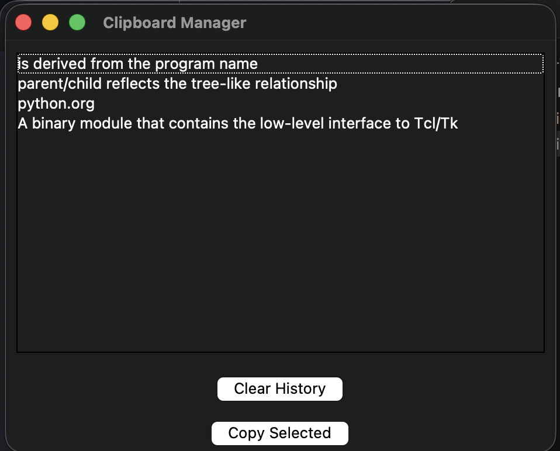
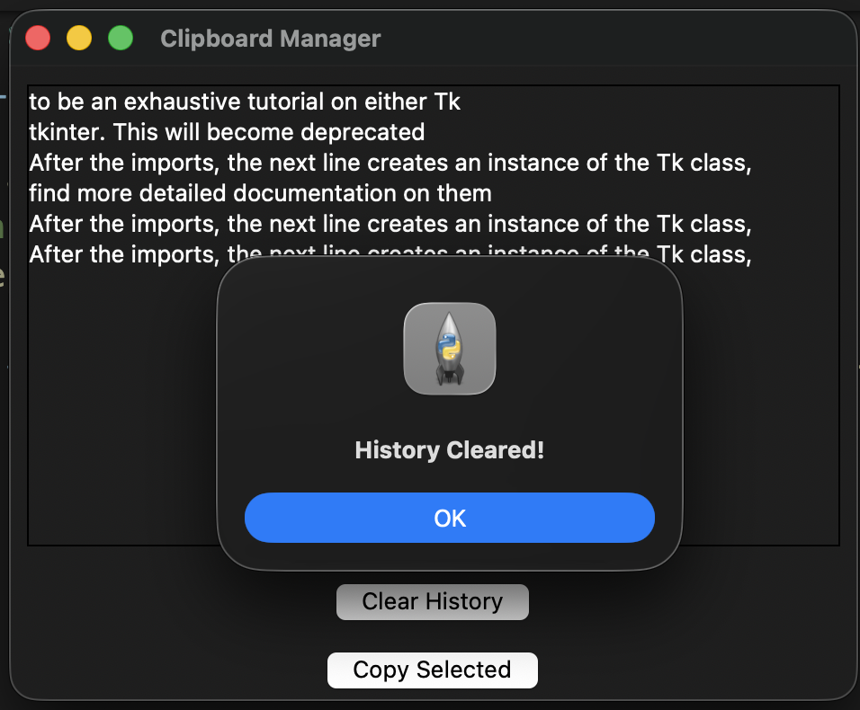
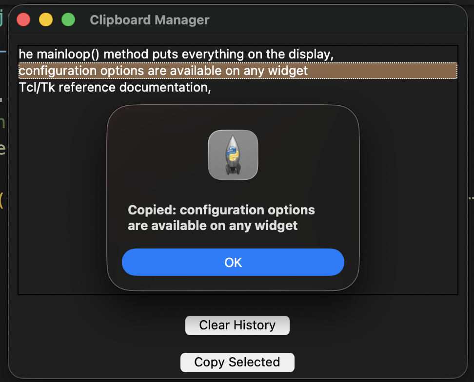

## Clipboard Manager

This is a simple python based GUI that scans clipboard every second and stores it in a json file. The tools used are python, pyperclip, os, tkinter.

## Features

- JSON file that stores the history of copied items.
- A clear history button that clears everything from the file when clicked.
- A copy item button which copies a selected item back into the clipboard.
- Python GUI program that remembers and stores the clipboard items upon exiting.

## Demo Examples

This is what the program looks like after it has been started and some items were copied to the clipboard. After each copy, a new item is written to the GUI. As a result, each item is stacked on top of each other, formatted vertically.

When clear button is pressed, everything that was stored in the JSON file after each copy is cleared. Additionally, the GUI is also cleared along with the file contents after pressing "OK" the window will be updated. 

It is possible to select an item from the list by clicking a line of text that is intended to be copied and clicking the copy selected button. After that button is clicked, the selected item is copied to the clipboard and is displayed as a most recent copied item.

## How to Use

1. Open a desired directory in a terminal or visual studio code.
2. Make sure python3 and pyperclip are installed. 
3. Clone the repository using this command: git clone git@github.com:yanabrex/python-clipboard-manager.git
4. Run it in the terminal by typing in: python3 clipboard.py